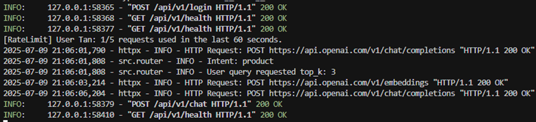

# ZUS Coffee Chatbot

A comprehensive AI-powered chatbot system for ZUS Coffee, featuring semantic product search, outlet location queries, and conversational AI capabilities. The project consists of two main components: a FastAPI backend service and a Streamlit frontend interface.

**Deployment repository:** [zus-api-deployment on Render](https://github.com/EASONTAN03/zus-api-deployment)

---

## 🧩 Conceptual Framework

The ZUS Coffee Chatbot system is designed as a modular, cloud-ready architecture that connects users to rich product and outlet data using advanced AI and search technologies. Below is a detailed conceptual framework:

```
+-------------------------------+
|        User (Web Browser)     |
+-------------------------------+
               |
               v
+-------------------------------+
|   Streamlit Frontend (UI)     |
|-------------------------------|
| - Chat interface              |
| - Login/Register              |
| - Session state (JWT, cache)  |
| - Calls FastAPI endpoints     |
+-------------------------------+
               |
               v
+-------------------------------+
|      FastAPI Backend          |
|-------------------------------|
| - /chat, /products, /outlets  |
| - /register, /login, /health  |
| - Reads config/env vars       |
| - Handles session/cache       |
+-------------------------------+
|   |           |           |   |
|   v           v           v   |
| Auth/Rate  Intent     Routers |
| Limiting   Detection  (Chat,  |
| (JWT,      (OpenAI    Product,|
| Throttle)  LLM)       Outlet) |
+-------------------------------+
|   |           |           |   |
|   v           v           v   |
|-------------------------------|
|  Core Logic & Chains          |
|-------------------------------|
| - Product Chain               |
| - Outlet Chain                |
| - Intent Chain                |
+-------------------------------+
|   |           |           |   |
|   v           v           v   |
|-------------------------------|
|  Data & External Services     |
|-------------------------------|
| - Pinecone Vector DB          |
|   (Semantic Product Search)   |
| - SQLite DB                   |
|   (Outlet Data)       |
| - OpenAI API (LLM)            |
|   (Intent, Summaries, Chat)   |
+-------------------------------+
|   |           |           |   |
|   v           v           v   |
|-------------------------------|
|  Data Pipeline (ETL)          |
|-------------------------------|
| - Web Scraping (Products,     |
|   Outlets)                    |
| - Data Cleaning/Processing    |
| - Embedding Generation        |
| - Updates Pinecone/SQLite     |
+-------------------------------+
|   |           |           |   |
|   v           v           v   |
+-------------------------------+
|  Config & Environment         |
|-------------------------------|
| - config.json                 |
| - .env / Render dashboard     |
+-------------------------------+
```

**Key Flows:**
- User interacts with the Streamlit UI, which manages session and sends requests to FastAPI.
- FastAPI handles authentication, rate limiting, intent detection, and routes requests to the appropriate logic chain.
- Product and outlet queries use Pinecone (semantic search) and SQLite (structured data).
- OpenAI API is used for intent classification and generating natural language responses.
- Data pipeline (scraping/ETL) keeps Pinecone and SQLite up to date.
- All components use configuration and environment variables for settings and secrets.

---

## 🏗️ Project Architecture

This project is organized into two separate repositories:

### 1. **ZUS API Deployment** ([Repository](https://github.com/EASONTAN03/zus-api-deployment))
- **FastAPI Backend Service** - Production-ready REST API
- **Docker Containerization** - Optimized for cloud deployment
- **Render Deployment** - Auto-deploying sync service
- **Vector Database Integration** - Pinecone for semantic search
- **SQL Database** - SQLite for outlet data

### 2. **RAG Chatbot Agent** ([Repository](https://github.com/EASONTAN03/rag-chatbot-agent))
- **Development & Documentation** - Project documentation and assets
- **Streamlit Interface** - User-friendly chatbot frontend
- **Data Pipeline** - Web scraping (notebbok) and data processing 
- **Notebooks** - Jupyter notebooks for development

---

## 🚀 Quick Start

### Option 1: Deployed API (Recommended)

The API is automatically deployed on Render and ready to use:

1. **API Base URL**: `https://zus-api-deployment.onrender.com/`
2. **API Documentation**: `https://zus-api-deployment.onrender.com/docs`
3. **Health Check**: `https://zus-api-deployment.onrender.com/api/v1/health`

### Option 2: Local Development

#### Prerequisites
- Python 3.11+
- [OpenAI API Key](https://platform.openai.com/)
- [Pinecone API Key](https://www.pinecone.io/)

#### Setup
##### API setup
1. **Clone the API repository**
   ```bash
   git clone https://github.com/EASONTAN03/zus-api-deployment.git
   cd rag-chatbot-agent/zus-api-deployment
   ```

2. **Install dependencies**
   ```bash
   conda create -n zus-api-test python=3.11
   conda activate zus-api-test 
   pip install -r requirements.txt
   ```

3. **Set environment variables**
   ```bash
   # Create .env file
   echo "OPENAI_API_KEY=your-openai-key" > .env
   echo "PINECONE_API_KEY=your-pinecone-key" >> .env
   echo "PINECONE_API_KEY=website/api/v1" >> .env
   ```
   website can be replace by domain e.g "https://zus-api-deployment.onrender.com/api/v1"

4. **Run the API locally**
   ```bash
   cd app
   uvicorn app:app --host 0.0.0.0 --port 8000 --reload
   ```

5. **Access the API**
   - API Docs: [http://localhost:8000/docs](http://localhost:8000/docs)
   - Health Check: [http://localhost:8000/api/v1/health](http://localhost:8000/api/v1/health)

##### UI deployment
1. **Install dependencies**
   pip install streamlit

2. **Run the UI locally**
   cd ../../
   streamlit run streamlit_app.py

---

## 📁 Project Structure

### ZUS API Deployment Repository
```
zus-api-deployment/
├── app/
│   ├── app.py              # FastAPI application entry point
│   ├── src/
│   │   ├── vectorstore.py  # Pinecone vector search logic
│   │   ├── text2SQL.py     # SQLite database operations
│   │   ├── utils.py        # Configuration and utilities
│   │   ├── openai_chain.py # LLM prompt chains
│   │   ├── rate_limit.py   # Rate limiting and auth
│   │   └── router.py       # API route handlers
│   └── data/               # Data files (CSV, SQL, DB)
├── Dockerfile              # Production containerization
├── render.yaml             # Render deployment configuration
├── requirements.txt        # Python dependencies
└── README.md              # The top-level README for developers using this project.
```

### RAG Chatbot Agent Repository
```
rag-chatbot-agent/
├── zus-api-deployment/     # API deployment files
├── docs/                   # Documentation
├── notebooks/              # Development notebooks
├── assets/                 # Images and assets
├── streamlit_app.py        # Chatbot UI 
├── .gitignore             # Git ignore rules
└── README.md              # The top-level README for developers using this project.
```

---

## 🔧 API Endpoints

### Core Endpoints
- `GET /` - API status and version
- `GET /api/v1/health` - Health check
- `POST /api/v1/chat` - Conversational chatbot
- `GET /api/v1/products` - Product search
- `GET /api/v1/outlets` - Outlet location search

### Example API Usage

```bash
# Health check
curl https://zus-coffee-chatbot.onrender.com/api/v1/health

# Chat with the bot
curl -X POST "https://zus-coffee-chatbot.onrender.com/api/v1/chat" \
  -H "Content-Type: application/json" \
  -d '{"message": "What products do you have?"}'

# Search products
curl "https://zus-coffee-chatbot.onrender.com/api/v1/products?query=tumbler"
```

---

## 🛠️ Features

### 🤖 AI-Powered Chatbot
- **Conversational Interface** - Natural language interaction
- **Intent Classification** - Automatic query understanding
- **Context Awareness** - Maintains conversation context
- **Multi-turn Dialogues** - Complex conversation handling

### 🔍 Semantic Product Search
- **Vector Database** - Pinecone for semantic similarity
- **Product Recommendations** - AI-driven suggestions
- **Detailed Product Info** - Complete product descriptions
- **Visual Search** - Product images and details

### 📍 Outlet Location Service
- **SQL Database** - Fast location queries
- **Geographic Search** - Location-based filtering
- **Store Information** - Complete outlet details
- **Real-time Data** - Up-to-date information

### 🚀 Production Ready
- **Docker Containerization** - Consistent deployment
- **Auto-deployment** - Render sync deployment
- **Health Monitoring** - Built-in health checks
- **Security Headers** - Production security
- **Rate Limiting** - API protection
- **CORS Support** - Cross-origin requests

---

## 🔐 Environment Variables

### Required Variables
```env
OPENAI_API_KEY=your-openai-api-key
PINECONE_API_KEY=your-pinecone-api-key
API_BASE_URL={website}/api/v1
```

### Optional Variables
```env
CORS_ORIGINS=*                    # CORS configuration
PYTHONPATH=/app                   # Python path
LOG_LEVEL=INFO                    # Logging level
ALGORITHM=HS256                   # JWT algorithm
```

---

## 🐳 Docker Deployment

### Local Docker Build
```bash
# Build the image
docker build -t zus-chatbot .

# Run the container
docker run -p 8000:8000 \
  -e OPENAI_API_KEY=your-key \
  -e PINECONE_API_KEY=your-key \
  zus-chatbot
```

### Render Deployment
The application is automatically deployed on Render with:
- **Auto-deploy** on code changes
- **Health monitoring**
- **SSL certificates**
- **Custom domain support**

---

## 📊 Data Sources

### Product Data
- **Web Scraping** - Automated data collection
- **Vector Embeddings** - Semantic search capabilities
- **Product Categories** - Organized product hierarchy
- **Pricing Information** - Real-time pricing

### Outlet Data
- **Location Database** - Geographic information
- **Store Details** - Complete outlet information
- **Operating Hours** - Business hours
- **Contact Information** - Store contact details

---

## 🧪 Development

### Local Development Setup
```bash
# Clone both repositories
git clone https://github.com/EASONTAN03/zus-api-deployment.git
git clone https://github.com/EASONTAN03/rag-chatbot-agent.git

# Set up development environment
cd zus-api-deployment
pip install -r requirements.txt
cd app && python app.py
```

### Testing
```bash
# API health check
curl http://localhost:8000/api/v1/health

# Test chat endpoint
curl -X POST "http://localhost:8000/api/v1/chat" \
  -H "Content-Type: application/json" \
  -d '{"message": "Hello"}'
```

---

## 🔍 Troubleshooting

### Common Issues

1. **Module Import Errors**
   - Ensure `PYTHONPATH=/app` is set
   - Check that all dependencies are installed

2. **API Key Issues**
   - Verify environment variables are set correctly
   - Check API key permissions and quotas

3. **Database Connection**
   - SQLite database auto-creates from CSV
   - Ensure data files are in the correct location

4. **Vector Store Issues**
   - Verify Pinecone API key and environment
   - Check vector index configuration

### Debug Mode
```bash
# Enable debug logging
export LOG_LEVEL=DEBUG
python app.py
```

---

## 📈 Performance

### Optimizations
- **Docker Layer Caching** - Faster builds
- **Production Requirements** - Optimized dependencies
- **Health Checks** - Automatic monitoring
- **Security Headers** - Production security

### Resource Usage
- **Memory**: ~512MB (Render Free Tier)
- **CPU**: Optimized for single-core
- **Storage**: Minimal disk usage
- **Network**: Efficient API responses

---

## 🤝 Contributing

1. **Fork the repositories**
   - [ZUS API Deployment](https://github.com/EASONTAN03/zus-api-deployment)
   - [RAG Chatbot Agent](https://github.com/EASONTAN03/rag-chatbot-agent)

2. **Create feature branches**
   ```bash
   git checkout -b feature/your-feature-name
   ```

3. **Make your changes**
   - Follow the existing code style
   - Add tests for new features
   - Update documentation

4. **Submit pull requests**
   - Clear description of changes
   - Include test results
   - Update relevant documentation

---

## 📄 License

This project is licensed under the MIT License. See the LICENSE file for details.

---

## 🆘 Support

- **GitHub Issues**: Report bugs and feature requests
- **API Documentation**: Available at `/docs` endpoint
- **Health Check**: Monitor service status
- **Deployment Status**: Check Render dashboard

---

## 🗺️ Roadmap

### Planned Features
- [ ] **Enhanced Semantic Search** - Improved product matching
- [ ] **Real-time Updates** - Live data synchronization
- [ ] **Mobile API Client** - Native mobile app
- [ ] **Analytics Dashboard** - Usage analytics
- [ ] **Multi-language Support** - Internationalization
- [ ] **Advanced Caching** - Redis integration
- [ ] **WebSocket Support** - Real-time chat
- [ ] **User Authentication** - JWT-based auth system

### Performance Improvements
- [ ] **CDN Integration** - Faster content delivery
- [ ] **Database Optimization** - Query performance
- [ ] **Caching Layer** - Response caching
- [ ] **Load Balancing** - Horizontal scaling

---

## 📞 Contact

- **GitHub**: [EASONTAN03](https://github.com/EASONTAN03)
- **API Status**: [Health Check](https://zus-coffee-chatbot.onrender.com/api/v1/health)
- **Documentation**: [API Docs](https://zus-coffee-chatbot.onrender.com/docs)

---

*Built with ❤️ for ZUS Coffee enthusiasts*

## 🖼️ Demo & Test Cases

### Product API Demo (`/products`)

| Test Case         | Prompt Example                                         | Demo Screenshot                                      |
|-------------------|-------------------------------------------------------|------------------------------------------------------|
| Normal query      | Show me the top 3 black drinkware items.              |        |
| Price-based query | Which ZUS tumblers are under RM50?                    |        |
| Style-based query | List elegant glass cups for gifts.                    |        |
| Ranking-based     | Give me the best 2-selling items in the Accessories category. |  |

---

### Outlet API Demo (`/outlets`)

| Test Case         | Prompt Example                                         | Demo Screenshot                                      |
|-------------------|-------------------------------------------------------|------------------------------------------------------|
| Location-specific | Where are ZUS Coffee outlets in Petaling Jaya?        |          |
| Time-specific     | Which outlets in Selangor open after 9pm?             |          |
| Feature-specific  | List outlets with self-pickup in Kuala Lumpur.        |          |
| Parking-related   | Show outlets with parking near Damansara.             |          |

---

### UI & Rate Limit Demo

- **Chatbot UI Example:**  
  

- **OAuth/Rate Limit Example:**  
  

---

### Render API Deployment Log

- **Render Dashboard (API Deployment Log Example):**  
  

---

Each screenshot above demonstrates a real interaction with the chatbot, using the prompts shown in the tables. The UI and rate limit images show the user experience and system protection in action. The Render dashboard image shows the deployment and live log monitoring for the API.
